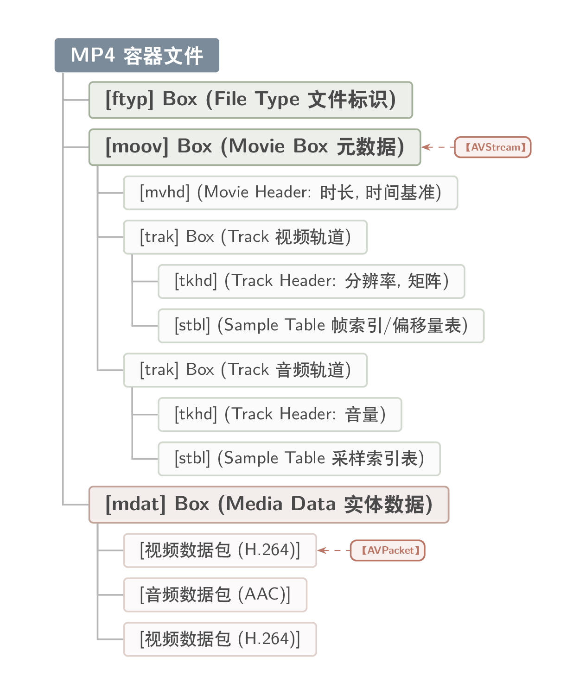
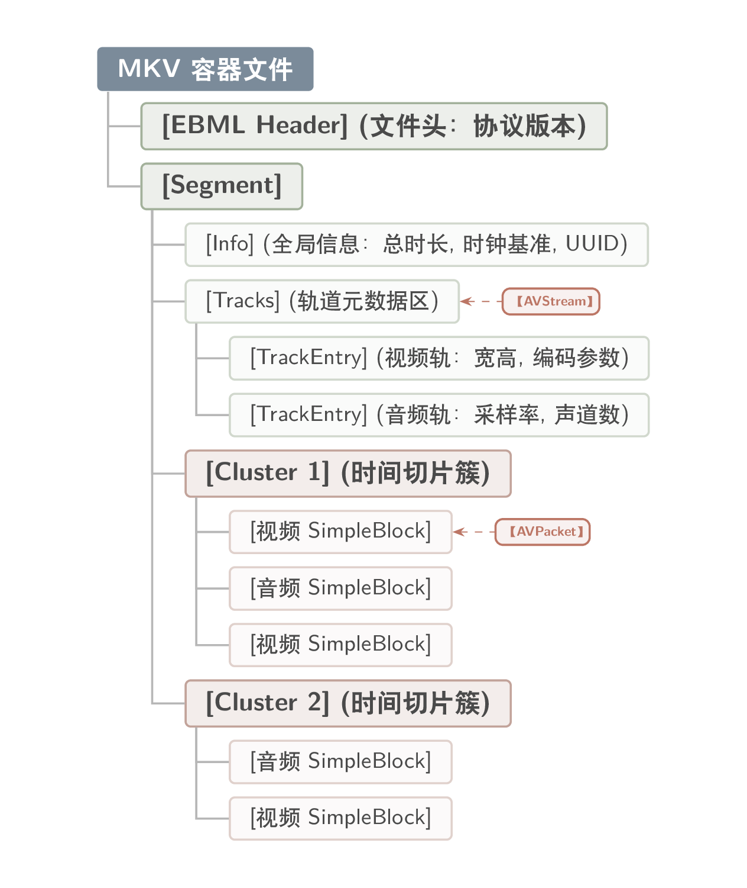
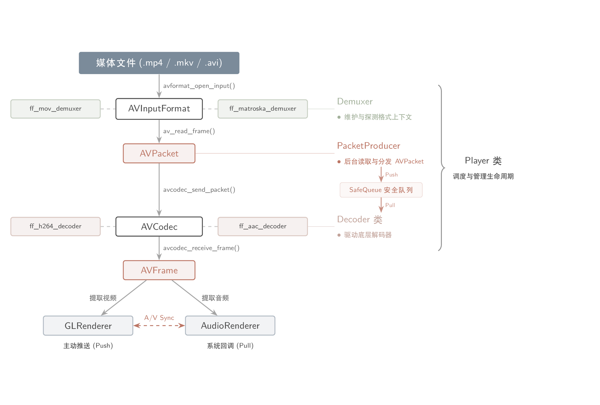

# 前言

多媒体文件（.MP4 / .MKV）本质是“容器/封装格式”，存储被压缩过的视频 / 音频包（Packets），以及字幕等信息。

1. MP4 数据结构（Box/Atom）

MP4 文件由一个个 Box 数据块嵌套而成（APPLE 中叫做 Atom），每个 Box 的头部：`[4字节大小] + [4字节类型名称]`。

基于上图的文件结构，FFmpeg 中对应三个底层对象：`AVFormatContext`, `AVStream`, `AVPacket`。

FFmpeg 的 `avformat_open_input()` 用于打开媒体文件的格式上下文（format context），在内存中创建 `AVFormatContext`，这一过程的实质是在解析媒体文件的元数据`[moov] Box`。在解析过程中，FFmpeg 会探测文件中存在的所有媒体轨道 `[trak] Box`，并在 `AVFormatContext` 的 `streams` 数组中分配并初始化一个对应的 `AVStream` 结构体。

> `AVStream` 是媒体文件的 Metadata Descriptor，但内部不包含实际的音视频压缩数据，仅仅是一份“说明书”。

实际的音视频压缩数据交织存放（Interleaving）在文件的 `[mdat] Box` 中，主要是为了满足流媒体传输的 I/O 需求，在 FFmpeg 中将压缩数据块抽象为 `AVPacket`，通过 `av_read_frame()` 进行统一读取（不论音频包还是视频包），所以需要用户自定义分发机制和安全队列。

2. MKV 数据结构（EBML 簇状流）

MKV 是一种基于 EBML（Extensible Binary Meta Language，可扩展二进制元语言） 的流式封装格式，类似于 XML 的树状标签嵌套。

MKV 没有 MP4 的全局索引表（Sample Table），而是将数据切分成了一个个自包含的 `[Cluster]`。每个 `[Cluster]` 拥有独立的局部时间戳。不过没关系，在开发者眼里，无论底层是 MP4、MKV、AVI 还是 FLV，它们都被抽象成了统一的接口。

3. FFmpeg 二级抽象层模型

通过容器抽象层（AVInputFormat）和算法抽象层（AVCodec），FFmpeg 将容器解析逻辑与解码逻辑从业务层剥离。

